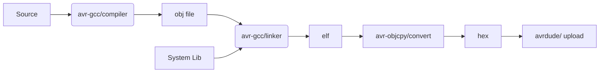

In this post we saw how to use arduino with c, compile build and upload to board
We use `PORTB` register to control classical LED blink  
using avr-gcc toolchain and vscode as our ide


## Install
- avr-gcc: tool chain
- avrdude: upload to embedded board
```
sudo apt install binutils gcc-avr avr-libc uisp avrdude flex byacc bison
```

## Compile and ..




## Arduino ports
- PORTB: digital pin 8-13
- PORTC: analog pin 0-5
- PORTD: digital pin 0-7

### Registers control PORTB

- PORTB: Port Data Register
- DDRB: Data direction Register (1: output)
- PINB: Input reading the state of input pins
- 


## Source code
source file main.c
```c
#include <avr/io.h>
#include <util/delay.h>

#define BLINK_DELAY_MS 1000
 
int main (void)
{
 /* set pin 5 of PORTB for output (D13)*/
 DDRB |= _BV(DDB5);
 
 while(1) {
  /* set pin 5 high to turn led on */
  PORTB |= _BV(PORTB5);
  _delay_ms(BLINK_DELAY_MS);
 
  /* set pin 5 low to turn led off */
  PORTB &= ~_BV(PORTB5);
  _delay_ms(BLINK_DELAY_MS);
 }
}
```
_BV(bit) is a macro defined in  avr/io.h file in AVR libraries.
The macro replaces all occurrences of _BV(bit) with 1 << bit .

## VSCode
- c_cpp_properties.json
  - ubuntu avr location: `/usr/lib/avr/include`
  - defines: arduino board for better resolve
```json
{
    "configurations": [
        {
            "name": "Linux",
            "includePath": [
                "${workspaceFolder}/**",
                "/usr/lib/avr/include/**"
            ],
            "defines": [
                "__AVR_ATmega328P__"
            ],
            "compilerPath": "/usr/lib/ccache/avr-gcc"
        }
    ],
    "version": 4
}
```

## compile and upload
```bash
# compile
avr-gcc -Os -DF_CPU=16000000UL -mmcu=atmega328p -c -o main.o main.c
# link
avr-gcc -mmcu=atmega328p led.o -o main
# convert
avr-objcopy -O ihex -R .eeprom main main.hex
#upload
$ avrdude -F -V -c arduino -p ATMEGA328P -P /dev/ttyUSB0 -b 115200 -U flash:w:main.hex
```

## Reference
- [Programming Arduino Uno in pure C](https://balau82.wordpress.com/2011/03/29/programming-arduino-uno-in-pure-c/)
- [Arduino Basics 103: Library, Port Manipulation, Bit Math, Faster PWM/ADC](https://www.youtube.com/watch?v=EVm0qVJ56II)