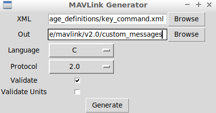

## Defination
- Add xml file `key_command.xml` to  `Firmware/mavlink/include/mavlink/v2.0/message_definitions/`

```xml
<?xml version="1.0"?>
<mavlink>
    <enums>
    </enums>
    <messages>
        <message id="150" name="key_command">
            <description> mavlink message creating test </description>
            <field type="char" name="command"> </field>
        </message>
    </messages>
</mavlink>
```

## Create header file
- use `mavgenerate.py` to create header file (from mavlink rep) in `Firmware/mavlink/include/mavlink/v2.0/custom_messages` folder



## uORB message
- Create `key_command.msg` file in `Firmware/msg`
```c
uint64 timestamp
char cmd
```
- Add to CMakeLists.txt
```
    set(msg_files
    ...
    key_command.msg
	)
```

## Edited mavlink_receiver.h
- Add to `mavlink_reciver.h` in `Firmware/src/modules/mavlink`

```c
#include <uORB/topics/key_command.h>
#include <v2.0/custom_messages/key_command/mavlink_msg_key_command.h>
...
class MavlinkReceiver
{
...
private:
    void handle_message_key_command(mavlink_message_t *msg);
...
    orb_advert_t _key_command_pub{nullptr};;
}
```
## Edited mavlink_receiver.cpp
```cpp
void MavlinkReceiver::handle_message(mavlink_message_t *msg)
{
...
    case MAVLINK_MSG_ID_key_command:
        handle_message_key_command(msg);
        break;
...
}

void
MavlinkReceiver::handle_message_key_command(mavlink_message_t *msg)
{
    mavlink_key_command_t man;
    mavlink_msg_key_command_decode(msg, &man);


    struct key_command_s key = {};

    key.timestamp = hrt_absolute_time();
    key.cmd = man.command;

    if (_key_command_pub == nullptr) {
        _key_command_pub = orb_advertise(ORB_ID(key_command), &key);

    } else {
        orb_publish(ORB_ID(key_command), _key_command_pub, &key);
    }
}
```

# Compile
```
make px4_sitl_default
```
# Reference
- [Sending custom nessage from mavros to px4](https://github.com/mavlink/mavros/issues/781)
- [middleware/mavlink messaging](https://dev.px4.io/en/middleware/mavlink.html)