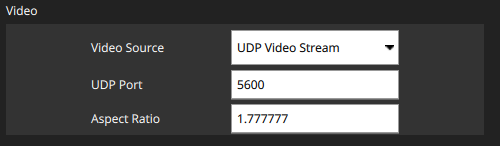
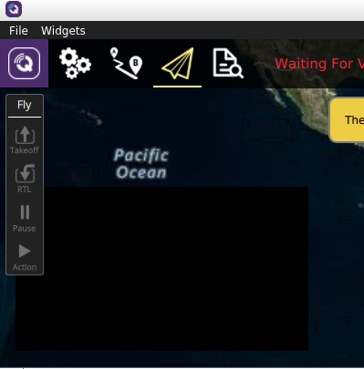

## Streaming RTP over UDP 
> UDP Port in QGC Must be 5600 
``` 
gst-launch-1.0 videotestsrc pattern="ball" ! \
 video/x-raw,width=640,height=480 ! \
 videoconvert ! \
 x264enc ! \
 rtph264pay ! \
 udpsink host=127.0.0.1 port=5600
```

##  QGC Settings
- From QGC settings


### QGC View
