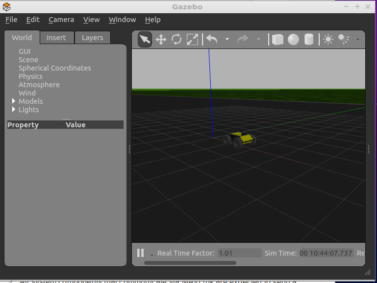

# Content
- Install Ardupilot SITL
- Install Ardupilot GAZEBO plugins
- Running APMRover over GAZEBO
- Control Rover using RC command
  - Using pymavlink
  - Using DroneKit


 
# Install Ardupilot SITL
## Setup environment
- Lubuntu 18.04
- Gazebo 9.0 (Installed with ROS melodic)
- Installed folder ~/apm

## Install Ardupilot
- Clone from github
```bash
git clone https://github.com/ArduPilot/ardupilot
cd ardupilot
git submodule update --init --recursive
```
> Note: [Git submodels](http://ardupilot.org/dev/docs/git-submodules.html)

- Add `PATH` to .bashrc
```
export PATH=$PATH:$HOME/ardupilot/Tools/autotest
```

> Note: check [Setting up the Build Environment ](http://ardupilot.org/dev/docs/building-setup-linux.html#building-setup-linux) for more setting instructions
  
> Note: permission: add  user to dialout group  
> `sudo usermod -a -G dialout $USER`

## First run
```bash
cd ardupilot/APMRover2
# wipe the virtual EEPROM and load the right default parameters for your vehicle
sim_vehicle.py -w
```
&nbsp;  
&nbsp;  
&nbsp;  
# Install Ardupilot GAZEBO plugins
There are two github projects that implement Ardupilot gazebo plugins
- [SwiftGust](https://github.com/SwiftGust/ardupilot_gazebo): checkout `gazebo9` branch
- [khancyr](https://github.com/khancyr/ardupilot_gazebo): master gazebo 8.x and higher
  

- Get model and world from SwiftGust git repo.
    
> The tutorial using khancyr version plugin, model and world from  SwiftGust repo
> - model: rover_ardupilot, husky
> - world: rover_ardupilot.world

## setup
- Clone
- Install `libgazebo9-dev`
- Compile source
- Modify gazebo environment variables
  - GAZEBO_MODEL_PATH
  - GAZEBO_RESOURCE_PATH

check [project github](https://github.com/khancyr/ardupilot_gazebo) for instructions

&nbsp;  
&nbsp;  
&nbsp;
## Run
> Run gazebo before SITL

- Terminal 1 (gazebo)
    - base on husky model
> source `gazebo` environment variables
```bash
gazebo --verbose rover_ardupilot.world
```

- Termianl 2 (rover SITL)
```bash
sim_vehicle.py -v APMrover2 -f gazebo-rover  -m --mav10 -I1
```
- -v VEHICLE
- -f frame
- -m MAVPROXY_ARGS
- -I INSTANCE





&nbsp;  
&nbsp;  
&nbsp;
# RC command
- Use rc_override
    - Servo 1: wheel
    - Servo 3: Throttle
  
- Terminal 1 (SITL)

```bash
MANUAL> mode MANUAL
MANUAL> Got MAVLink msg: COMMAND_ACK {command : 11, result : 0}
# ARM
MANUAL> arm throttle
MANUAL> APM: Throttle armed
Got MAVLink msg: COMMAND_ACK {command : 400, result : 0}
ARMED

#forward
MANUAL> rc 3 1600
#stop
MANUAL> rc 3 1500
#reverse
MANUAL> rc 3 1400
MANUAL> rc 3 1500

#view servo status
MANUAL> status servo*
MANUAL> 155543: SERVO_OUTPUT_RAW {time_usec : 278102261, port : 0, servo1_raw : 1500, servo2_raw : 0, servo3_raw : 1500, servo4_raw : 0, servo5_raw : 0, servo6_raw : 0, servo7_raw : 0, servo8_raw : 0}
```

> To stop the vehicle both servo (1,3) need to set: pwm 1500 

## pymavlink Example
```python
#! /usr/bin/env python

connection_string = "udp:127.0.0.1:14560"
import time
from pymavlink import mavutil

# Connect to the Vehicle.
print("Connecting to vehicle on: %s" % (connection_string,))
master = mavutil.mavlink_connection(connection_string)
# Wait a heartbeat before sending commands
master.wait_heartbeat()

def set_rc_channel_pwm(id, pwm=1500):
    """ Set RC channel pwm value
    Args:
        id (TYPE): Channel ID
        pwm (int, optional): Channel pwm value 1100-1900
    """
    if id < 1:
        print("Channel does not exist.")
        return

    # We only have 8 channels
    #http://mavlink.org/messages/common#RC_CHANNELS_OVERRIDE
    if id < 9:
        rc_channel_values = [65535 for _ in range(8)]
        rc_channel_values[id - 1] = pwm
        master.mav.rc_channels_override_send(
            master.target_system,                # target_system
            master.target_component,             # target_component
            *rc_channel_values)                  # RC channel list, in microseconds.
        msg = master.recv_match()

THROTTLE=3
WHEEL=1

mode = 'MANUAL'
master.set_mode_apm(mode)
master.arducopter_arm()
set_rc_channel_pwm(WHEEL, 1600)
set_rc_channel_pwm(THROTTLE, 2000)
time.sleep(2)
# stop the rover
set_rc_channel_pwm(WHEEL, 1500)
set_rc_channel_pwm(THROTTLE, 1500)

print("Completed")
```

## Dronekit example
```python
import time
from dronekit import connect, VehicleMode, LocationGlobal, LocationGlobalRelative

connection_string = "udp:127.0.0.1:14560"
print 'Connecting to vehicle on: %s' % connection_string
vehicle = connect(connection_string, wait_ready=True)

while not vehicle.is_armable:
    print " Waiting for vehicle to initialise..."
    time.sleep(1)

print "Arming motors"
vehicle.mode = VehicleMode("MANUAL")
vehicle.armed = True

while not vehicle.armed:
    print " Waiting for arming..."
    time.sleep(1)

THROTTLE = 1700
WHEEL = 1700

# Must  send all values
# Each value in separated command
print "\nChannel overrides: %s" % vehicle.channels
vehicle.channels.overrides = {'1': 65535, '2': 65535,'3': THROTTLE,'4':65535, '5':65535,'6':65535,'7':65535,'8':65535}
vehicle.channels.overrides = {'1': WHEEL, '2': 65535,'3': 65535,'4':65535, '5':65535,'6':65535,'7':65535,'8':65535}

time.sleep(2)
```
## Reference
- [Ardupilot gazebo](https://github.com/SwiftGust/ardupilot_gazebo)
- [Using Gazebo Simulator with SITL](http://ardupilot.org/dev/docs/using-gazebo-simulator-with-sitl.html)
- [Ardusub gitbook](https://www.ardusub.com/developers/pymavlink.html)
