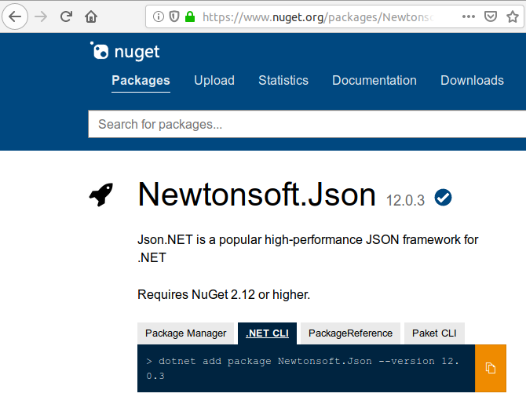

# LAB
- Install .Net core on ubuntu machine
- Config VSCode 
- Write C# hello world
- Using nuget to get json library
&nbsp;  
&nbsp;  
&nbsp;  
# Install
```bash
sudo apt-get install -y gpg
wget -qO- https://packages.microsoft.com/keys/microsoft.asc | gpg --dearmor -o microsoft.asc.gpg
sudo mv microsoft.asc.gpg /etc/apt/trusted.gpg.d/
wget -q https://packages.microsoft.com/config/ubuntu/18.04/prod.list
sudo mv prod.list /etc/apt/sources.list.d/microsoft-prod.list
sudo chown root:root /etc/apt/trusted.gpg.d/microsoft.asc.gpg
sudo chown root:root /etc/apt/sources.list.d/microsoft-prod.list
sudo apt-get install -y apt-transport-https
sudo apt-get update
sudo apt-get install dotnet-sdk-3.1
```

## check
```bash
dotnet --list-sdks
#
3.1.102 [/usr/share/dotnet/sdk]
```

## VSCode
Install extension [C#](https://marketplace.visualstudio.com/items?itemName=ms-vscode.csharp)

&nbsp;  
&nbsp;  
&nbsp;  
# Hello world
- Create project folder
- Run dotnet cli `dotnet new console`
  - create project files and basic main function
- First build create `.vscode` folder
- Running from console / or add task

```
dotnet run
```

program.cs
```c#
using System;

namespace csharp_tutorial
{
    class Program
    {
        static void Main(string[] args)
        {
            Console.WriteLine("Hello World!");
        }
    }
}
```
&nbsp;  
&nbsp;  
&nbsp;  

# Install json package
- Search nuget search
- using dotnet cli to install package
    - cli add reference to project settings



- From project folder 

```bash
# Version is optional
dotnet add package Newtonsoft.Json --version 12.0.3
```

## json example
program.cs
```c#
using System;

namespace csharp_tutorial
{
    class Program
    {
        static void Main(string[] args)
        {
            var account = new Account();
            Console.WriteLine(account.to_json());
        }
    }
}
```

Account.cs
```c#
using Newtonsoft.Json;
using System;

namespace csharp_tutorial
{
    public class Account
    {
        public Account(){
            this.Name = "my_name";
            this.Email = "my_name@domain.com";
            this.DOB = DateTime.Now;
        }
        public string Name { get; set; }
        public string Email { get; set; }
        public DateTime DOB { get; set; }

        public string to_json(){
            string json=JsonConvert.SerializeObject(this, Formatting.Indented);
            return json;
        }
    }
}
```

&nbsp;  
&nbsp;  
&nbsp;  
# Reference 
- [Ubuntu 18.04 Package Manager - Install .NET Core](https://docs.microsoft.com/en-us/dotnet/core/install/linux-package-manager-ubuntu-1804#troubleshoot-the-package-manager)