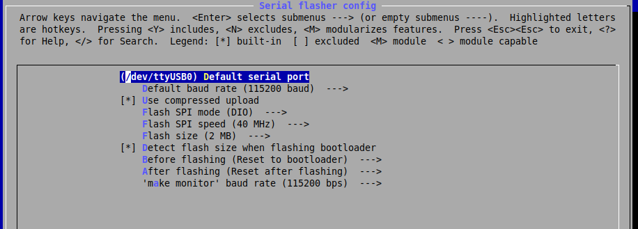

## Hello
- Setup Toolchain
- Getting ESP-IDF from github
- Setup IDE

### Toolchain
> Preferred to use ~/esp folder for install

- Prerequisites
```bash
sudo apt-get install gcc git wget make libncurses-dev flex bison gperf python python-pip python-setuptools python-serial python-cryptography python-future python-pyparsing
```
- Download toolchain
- Extract into `~/esp` folder
- Add toolchain folder to `path`
```bash
# edit  ~/.profile
export PATH="$HOME/esp/xtensa-esp32-elf/bin:$PATH"
``` 
- Add current user to dialup group

### Get ESP-IDF
```bash
cd esp
git clone --recursive https://github.com/espressif/esp-idf.git
```
- Add IDF_PATH to .profile
```bash
export IDF_PATH=~/esp/esp-idf
```
- Install required python packages
```bash
python -m pip install --user -r $IDF_PATH/requirements.txt
```

### Start project
- Connect 
- dmesg
```bash
usb 3-4: new full-speed USB device number 10 using xhci_hcd
[302290.742862] usb 3-4: New USB device strings: Mfr=1, Product=2, SerialNumber=3
[302290.742857] usb 3-4: New USB device found, idVendor=10c4, idProduct=ea60
[302290.742865] usb 3-4: Product: CP2102N USB to UART Bridge Controller
[302290.742868] usb 3-4: Manufacturer: Silicon Labs
[302290.742870] usb 3-4: SerialNumber: f230aaea0a3fe811828a3f657a7060d0
[302290.756360] usbcore: registered new interface driver usbserial_generic
[302290.756369] usbserial: USB Serial support registered for generic
[302290.758057] usbcore: registered new interface driver cp210x
[302290.758068] usbserial: USB Serial support registered for cp210x
[302290.758105] cp210x 3-4:1.0: cp210x converter detected
[302290.758748] usb 3-4: cp210x converter now attached to ttyUSB0

```
- configure serial port to use
    - from main menu select `Serial flasher config`

- Build and flash
```bash
make flash
```

- Monitor
```bash
make monitor
```
## Board (ESP32 DevKitC)
- ESP32-WROOM-32D


## Terms
- ESP-IDF: Espressif IoT Development Framework

## Reference
- [ESP32-DevKitC V4 Getting Started Guide](https://docs.espressif.com/projects/esp-idf/en/latest/index.html)
- [ESP32](https://www.youtube.com/watch?v=jz7MxbcKMgU&list=PLLYZoEqwvzM35p2Kc7bk7bkwxLtTVwpvy)