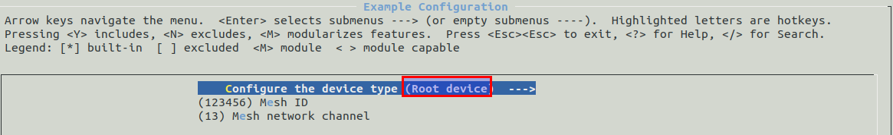

### Get ESP-IDF
```bash
cd ~/esp
git clone --recursive https://github.com/espressif/esp-mdf.git
```

### Setup
- Add IDF_PATH to  `.profile` file
```bash
export MDF_PATH=$HOME/esp/esp-mdf
```

### Get started example
- Root node
- None-root node

#### menuconfig
From `Example Configuration`


- make
```bash
make erase_flash flash -j5  ESPBAUD=921600 ESPPORT=/dev/ttyUSB0
```

- monitor
```bash
make monitor ESPBAUD=921600 ESPPORT=/dev/ttyUSB0
```

## References
- [ESP-MDF Programing Guide](https://docs.espressif.com/projects/esp-mdf/en/latest/)
- [ESP-MESH](https://docs.espressif.com/projects/esp-idf/en/latest/api-guides/mesh.html)
- [get-started](https://github.com/espressif/esp-mdf/tree/master/examples/get-started)
