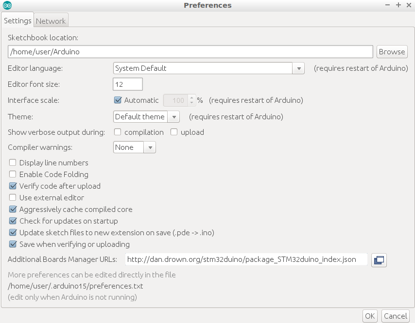
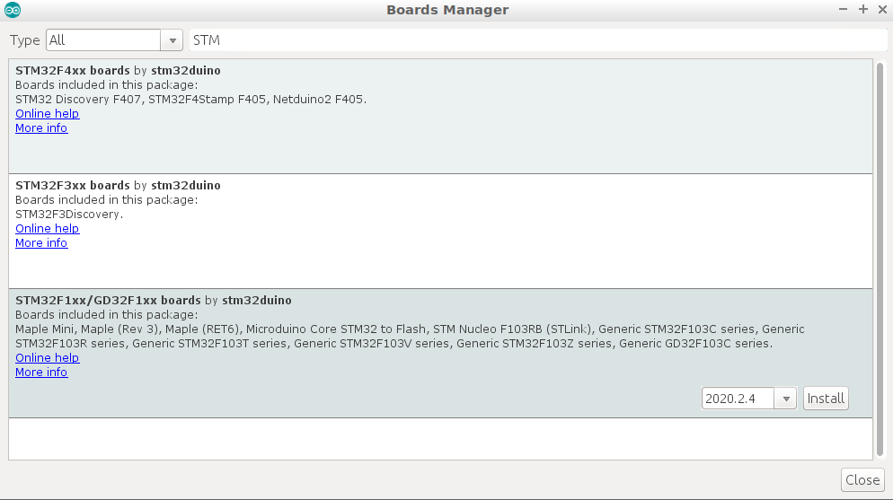

# BOM
- STM32F103C8T6
- FT232RL 3.3V 5.5V FTDI USB to TTL Serial Adapter

&nbsp;  
&nbsp;  
&nbsp;  
# Arduino IDE
## install additional board manager
- open File -> Preference
- paste url in **Additional Boards Manager URLs** : `http://dan.drown.org/stm32duino/package_STM32duino_index.json`
  


- From Tools -> Board -> Boards Manager
- Filter STM
- Install `STM32F1xx`

 
&nbsp;  
&nbsp;  
&nbsp;  
## Wirings
- Connect STM to Serial-to-USB
> Important Set FTDI to 3.3v jumper  mark in yellow

| FTDI    | STM32 |
| --    | -- |
| TX | PA10 (rx) |
| RX | PA9 (tx) |
| GND | GND |
| VCC | 3v3 |


## Check ide Settings

- Board: Generic STM32F103C6/fake STM32F103C8
- Upload Method: Serial

  


&nbsp;  
&nbsp;  
&nbsp;  
## First Sketch

```cpp
void setup() {
    // Set up the built-in LED pin as an output:
    pinMode(PC13, OUTPUT);
}

void loop() {
    digitalWrite(PC13,!digitalRead(PC13));// Turn the LED from off to on, or on to off
    delay(1000);          // Wait for 1 second (1000 milliseconds)
}
```

## Upload / Flushing
- Set `BOOT` sw to programing mode
- Run `upload`


&nbsp;  
&nbsp;  
&nbsp;  
# Notes
## Another wiring
 - 3.3 v


&nbsp;  
&nbsp;  
&nbsp;  
# Using RPI as Writer
- usb connection


```
stm32flash -v -w ~/tmp/hid_generic_pc13.bin /dev/serial0
```
# Reference
- [Getting Started With Stm32 Using Arduino IDE](https://www.instructables.com/id/Getting-Started-With-Stm32-Using-Arduino-IDE/)