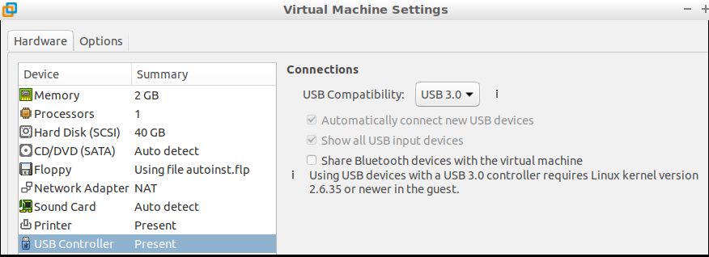
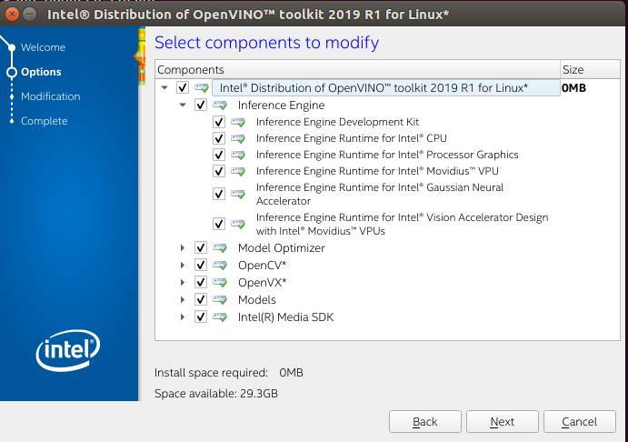

- Tutorial
- Check stick HW
- Install VM and Intel Openvino toolkit
- Run Demos

## Tutorial
- [YouTube OpenVINO toolkit](https://www.youtube.com/playlist?list=PLDKCjIU5YH6jMzcTV5_cxX9aPHsborbXQ)
- [Intel Openvino toolkit](https://software.intel.com/en-us/openvino-toolkit)

## Check NSC Stick
- Check that host computer recognized the stick
- dmesg output
```
[1493885.169757] usb 3-4: New USB device found, idVendor=03e7, idProduct=2485
[1493885.169759] usb 3-4: New USB device strings: Mfr=1, Product=2, SerialNumber=3
[1493885.169760] usb 3-4: Product: Movidius MyriadX
[1493885.169761] usb 3-4: Manufacturer: Movidius Ltd.
[1493885.169762] usb 3-4: SerialNumber: 03e72485
``` 

## Install VM Machine
- I Use VMWorkstation (Virtualbox fail to find the stick (try usb3 :) )
- Enabled USB3
  

- Install Ubuntu 16.04 desktop

## Download toolkit
- From intel toolkit main page menu ->  select `Choose & Download`
- Download toolkit (linux)
  - Install dependencies `install_openvino_dependencies.sh`
  - Install GUI `sudo install_GUI.sh`



## Run first demo
```
/opt/intel/openvino/deployment_tools/demo
./demo_squeezenet_download_convert_run.sh
```
- The script steps
  - set `setupvars.sh`
  - Download model `Caffe model`
  - Install  dependencies
  - Build
  - Run


- Image to classify
  

- Result
```
classid probability label
------- ----------- -----
817     0.8363336   sports car, sport car
511     0.0946490   convertible
479     0.0419133   car wheel

```

## More samples
### Code Sample from intel web site
 


### Code sample from install toolkit
  
- `/opt/intel/openvino/`
  - ./deployment_tools/inference_engine/samples
  - ./openvx/samples
  - ./opencv/samples

- Compile 
>  Don't forget to source `bin/setupvers.sh`
  - Create build folder under ``
  - `cmake ..` and run `make`

> Executable are in `build/intel64/Release` sub folder


## Download model
- Run model_downloader from `/opt/intel/openvino/deployment_tools/tools/model_downloader`

```
./downloader.py --print_all
#
output all available  models
```

-  Download model for demo
```
./downloader.py --name vehicle-license-plate-detection-barrier-0106 -o /home/user/models/
```

## Run Demo

- Run `security_barrier_camera_demo -i <image> -m <model>`

```
./security_barrier_camera_demo \
-i /opt/intel/openvino/deployment_tools/demo/car_1.bmp \
-m /home/user/models/Security/object_detection/barrier/0106/dldt/vehicle-license-plate-detection-barrier-0106.xml
```


# References
-  [Smart video workshop](https://github.com/intel-iot-devkit/smart-video-workshop)
-  [Code-samples](https://software.intel.com/en-us/openvino-toolkit/documentation/code-samples)