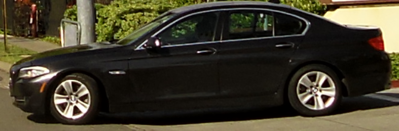
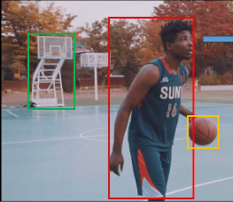

- Tutorial
- Check stick HW
- Install VM and Intel Openvino toolkit
- Run Demos

## Tutorial
- [YouTube OpenVINO toolkit](https://www.youtube.com/playlist?list=PLDKCjIU5YH6jMzcTV5_cxX9aPHsborbXQ)
- [Intel Openvino toolkit](https://software.intel.com/en-us/openvino-toolkit)

## Run first demo
```
/opt/intel/openvino/deployment_tools/demo
./demo_squeezenet_download_convert_run.sh
```
- The script steps
  - set `setupvars.sh`
  - Download model `Caffe model`
  - Install  dependencies
  - Build
  - Run


- Image to classify
  

- Result
```
classid probability label
------- ----------- -----
817     0.8363336   sports car, sport car
511     0.0946490   convertible
479     0.0419133   car wheel

```

## More samples
### Code Sample from intel web site
 


### Code sample from install toolkit
  
- `/opt/intel/openvino/`
  - ./deployment_tools/inference_engine/samples
  - ./openvx/samples
  - ./opencv/samples

- Compile 
>  Don't forget to source `bin/setupvers.sh`
  - Create build folder under ``
  - `cmake ..` and run `make`

> Executable are in `build/intel64/Release` sub folder


## Download model
- Run model_downloader from `/opt/intel/openvino/deployment_tools/tools/model_downloader`

```
./downloader.py --print_all
#
output all available  models
```

-  Download model for demo
```
./downloader.py --name vehicle-license-plate-detection-barrier-0106 -o /home/user/models/
```

## Run Demo

- Run `security_barrier_camera_demo -i <image> -m <model>`

```
./security_barrier_camera_demo \
-i /opt/intel/openvino/deployment_tools/demo/car_1.bmp \
-m /home/user/models/Security/object_detection/barrier/0106/dldt/vehicle-license-plate-detection-barrier-0106.xml
```


#Deep learning 
- "Per Frame" operations
    - Detection
    - Classification
    - Segmentation
- Across Frames
    - Tracking
    - Counting
- Higher level
    - Intentions
    - Relations
  
### Detection 
Where is the object, Detect object in the image, output list of coordinate surround the object
  
  

### Classification: 
What is that object


### Segmentation
Mark the object 
- 


# 06 Model Downloader
- [Video](https://www.youtube.com/watch?v=lKO_2knG2aA&list=PLDKCjIU5YH6jMzcTV5_cxX9aPHsborbXQ&index=6)

## Download Public Model
- source `bin/setvars.sh`
- cd `/opt/intel/openvino/deployment_tools/tools/model_downloader`

- Show all available models
```
./downloader.py --print_all
```

--  Download model
```
./downloader.py --name squeezenet1.1
```


# 08 Model Optimizer concept
- [Video](https://www.youtube.com/watch?v=Kl1ptVb7aI8&list=PLDKCjIU5YH6jMzcTV5_cxX9aPHsborbXQ&index=8)

Mapping between pre-trained model to processor unit (CPU, GPU, VPU, FPGA)
-  Convert model to one unified presentation `IR`
   -  .xml (model topology)
   -  .bin (wight and biases)
-  Optimize
-  Weights format (convert wight to suite the processing unit)


# 09 Model optimizer basic operation
- [Video](https://www.youtube.com/watch?v=BBt1rseDcy0)

## Prepared and Run
### Use caffe  model
- Set the model optimizer prerequisite
- Run `mo_caffe.py`
```
python3 mo_caffe.py --input_model /opt/intel/openvino/deployment_tools/tools/model_downloader/classification/squeezenet/1.1/caffe/squeezenet1.1.caffemodel
```
> Use `--output_dir` to redirect output `IR` files
> Use `--model_name` to control `IR` files name

-- Result
```
[ SUCCESS ] Generated IR model.
[ SUCCESS ] XML file: /opt/intel/openvino_2019.1.094/deployment_tools/model_optimizer/./squeezenet1.1.xml
[ SUCCESS ] BIN file: /opt/intel/openvino_2019.1.094/deployment_tools/model_optimizer/./squeezenet1.1.bin
[ SUCCESS ] Total execution time: 3.51 seconds.
```

```
/opt/intel/openvino/deployment_tools/model_optimizer
```

## 10 Choosing the right precision
- [Vido](https://youtu.be/RF8ypHyiKrY?list=PLDKCjIU5YH6jMzcTV5_cxX9aPHsborbXQ)


--data_type FP16

# References
-  [Smart video workshop](https://github.com/intel-iot-devkit/smart-video-workshop)
-  [Code-samples](https://software.intel.com/en-us/openvino-toolkit/documentation/code-samples)
-  [Overview of OpenVINO™ Toolkit Pre-Trained Models](https://github.com/opencv/open_model_zoo/blob/master/intel_models/index.md)


./tutorial1 -i $SV/object-detection/Cars-1900.mp4 -m $SV/object-detection/mobilenet-ssd/FP32/mobilenet-ssd.xml 

./ROIviewer -i $SV/object-detection/Cars-1900.mp4 -l $SV/object-detection/pascal_voc_classes.txt 

python3 mo_caffe.py --input_model /opt/intel/openvino/deployment_tools/tools/model_downloader/object_detection/common/mobilenet-ssd/caffe/mobilenet-ssd.caffemodel -o $SV/object-detection/mobilenet-ssd/FP16 --data_type FP16

./tutorial1 -d MYRAID-i $SV/object-detection/Cars-1900.mp4 -m $SV/object-detection/mobilenet-ssd/FP16/mobilenet-ssd.xml 