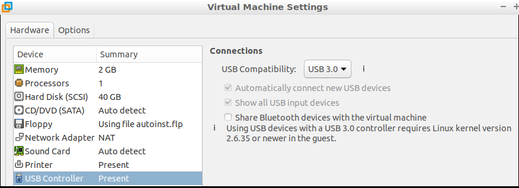
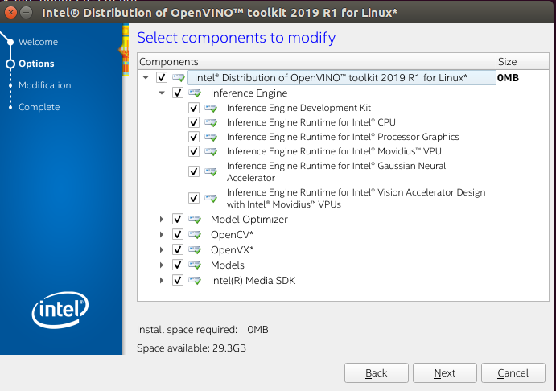

- [YouTube OpenVINO toolkit](https://www.youtube.com/playlist?list=PLDKCjIU5YH6jMzcTV5_cxX9aPHsborbXQ)
- [Intel Openvino toolkit](https://software.intel.com/en-us/openvino-toolkit)

## Pre-installation
- Check that host computer recognized the stick
- dmesg output
```
[1493885.169757] usb 3-4: New USB device found, idVendor=03e7, idProduct=2485
[1493885.169759] usb 3-4: New USB device strings: Mfr=1, Product=2, SerialNumber=3
[1493885.169760] usb 3-4: Product: Movidius MyriadX
[1493885.169761] usb 3-4: Manufacturer: Movidius Ltd.
[1493885.169762] usb 3-4: SerialNumber: 03e72485
``` 

## Install VM Machine
- I Use VMWorkstation (Virtualbox fail to find the stick (try usb3 :) )
- Enabled USB3
  

- Install Ubuntu 16.04 desktop

## Download toolkit
- From intel toolkit main page menu ->  select `Choose & Download`
- Download toolkit
  - Install dependencies `install_openvino_dependencies.sh`
  - Install GUI `install_GUI.sh`



## Run first demo
```
/opt/intel/openvino/deployment_tools/demo
./demo_squeezenet_download_convert_run.sh
```
  - Run process
  - set `setupvars.sh`
  - Download model `Caffe model`
  - Install  dependencies
  - Build
  - Run


- Image to classify
  

- Result
```
classid probability label
------- ----------- -----
817     0.8363336   sports car, sport car
511     0.0946490   convertible
479     0.0419133   car wheel

```