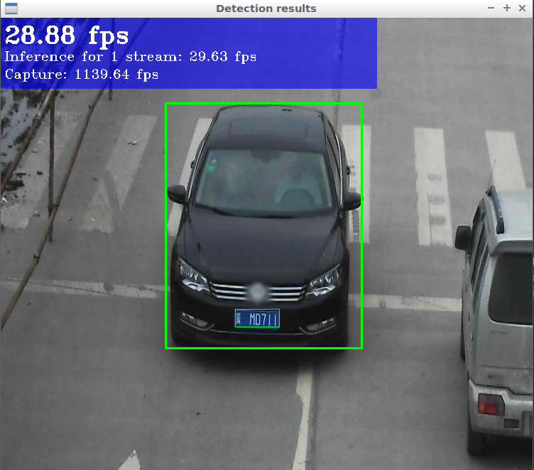

## Objectives
- Create openvino docker
  - GUI enabled
- Share folder  between host and guest
- VSCode settings
  - Run docker container
  - Set intellisense, python and cpp
  - Remote  Build and debug
- Run demo


# Docker
- Dockerfile
- Docker-compose
- VSCode integration

## Dockerfile
- Base on ubuntu 16:04
- Use pre download openvino tar
- Add user
- Create python virtualenv
  - create link to opencv so library (`cv2.cpython-36m-x86_64-linux-gnu.so`)
- Add Alias
  - set_vino: source setupvars.sh
  - ae/de: Activate/deactivate virtualenv
- Install openssh-server to enabled `sshfs`

# Docker-compose
- Volumes
  - x11 support 
  - share `/dev` folder for ncs support
  - create share for project folder
  - create share for models  and optimize models
- network mode: host
- privileged: true


```
version: "2.0"
services: 
  dev-image:
    image: zebra:latest
    container_name: openvino-dev
    privileged: true
    network_mode: host
    environment:
      - DISPLAY
    ports:
      - "2000:2000"
    volumes: 
      - ~/.Xauthority:/root/.Xauthority:rw
      - /tmp/.X11-unix:/tmp/.X11-unix
      - /dev:/dev
      - /home/user/projects/openvino_tutorial:/home/user/project
      - /home/user/intel:/home/user/intel
    command: /bin/bash
```

# VSCode tasks
- Run container
    - use script to enabled  gui support (try to find better way)

```bash
#!/bin/bash
xhost +si:localuser:$USER
xhost +local:docker
export DISPLAY=$DISPLAY
docker-compose -f docker-compose.yaml run --rm \
    --service-ports \
    --name devenv \
    dev-image \
    /bin/bash
```

## tasks
```
{
    "version": "2.0.0",
    "tasks": [
        {
            "label": "start develop env",
            "type": "shell",
            "command": "./scripts/gui-docker.sh",
            "problemMatcher": []
        },
        {
            "label": "stop dev env",
            "type": "shell",
            "command": "docker-compose -f develop-compose.yml down",
            "problemMatcher": []
        }
    ]
}
```

# Build demos
- Create `build` folder under `intel` share folder
- Run `cmake` from `build` folder
```
cmake /opt/intel/openvino/deployment_tools/inference_engine/samples
make
```
- All binaries found under `build\intel64\Releases`
- Download models for `security_barrier_camera_demo`
```
cd ~/intel/ir_models/FP16

wget https://download.01.org/openvinotoolkit/2018_R4/open_model_zoo/vehicle-license-plate-detection-barrier-0106/FP16/vehicle-license-plate-detection-barrier-0106.bin

wget https://download.01.org/openvinotoolkit/2018_R4/open_model_zoo/vehicle-license-plate-detection-barrier-0106/FP16/vehicle-license-plate-detection-barrier-0106.xml
```
- Goto demos folder `build\intel64\Releases` and run
  - Use ncs `-d MYRIAD`

> Note: check why sudo are needed

```
 sudo ./security_barrier_camera_demo \
 -i /opt/intel/openvino/deployment_tools/demo/car_1.bmp \
 -m ~/intel/ir_models/FP16/vehicle-license-plate-detection-barrier-0106.xml \
 -d MYRIAD
```


# Reference
- [optimize models](https://download.01.org/openvinotoolkit/2018_R4/open_model_zoo/)

- [Next use case](https://docs.openvinotoolkit.org/2019_R1/_pedestrian_detection_adas_binary_0001_description_pedestrian_detection_adas_binary_0001.html)
- [openvino docker](https://github.com/sugarkubes/openvino-base-image/blob/master/Dockerfile)
## Dockerfile
```
FROM ubuntu:16.04

RUN apt-get update && apt-get install -y --no-install-recommends \
    wget \
    cpio \
    sudo \
    git \
    libgflags-dev #gflags.h: No such file or directory \
    net-tools \
    iputils-ping \
    x11-apps  # test x11 gui support \
    lsb-core \
    curl \
    ca-certificates \
    python3-pip \
    python3-dev \
    virtualenv \
    libgomp1 \
    unzip \
    vim \
    libgtk2.0-dev \
    openssh-server \
    cmake \
    libusb-1.0-0 \
    && rm -rf /var/lib/apt/lists/*

ARG INSTALL_DIR=/opt/intel/openvino
ARG TEMP_DIR=/tmp/openvino_installer

# WORKDIR /home/user/Downloads

COPY l_openvino_toolkit*.tgz $TEMP_DIR/
RUN cd $TEMP_DIR && pwd && ls && \
    tar xf l_openvino_toolkit*.tgz && \
    cd l_openvino_toolkit* && \
    sed -i 's/decline/accept/g' silent.cfg && \
    # sed -i 's/COMPONENTS=DEFAULTS/COMPONENTS=;intel-ism__noarch;intel-cv-sdk-base-shared__noarch;intel-cv-sdk-base-l-setupvars__noarch;intel-cv-sdk-base-l-inference-engine__noarch;intel-cv-sdk-base-gfx-install__noarch;intel-cv-sdk-base-shared-pset/g' silent.cfg && \
    ./install.sh -s silent.cfg && \
    mv $INSTALL_DIR/python/python3.5/cv2.cpython-35m-x86_64-linux-gnu.so $INSTALL_DIR/python/python3.5/cv2.so

RUN cd $INSTALL_DIR/deployment_tools/model_optimizer/install_prerequisites && \
    ./install_prerequisites_caffe.sh

RUN useradd -rm -d /home/user -s /bin/bash -G sudo -u 1000 user
RUN echo "%sudo	ALL=(ALL:ALL) ALL" >> /etc/sudoers
RUN echo "user:user" | chpasswd

# #temp declare above cacheing resolve for know
# RUN apt-get update && apt-get install -y --no-install-recommends \
#     lsb-core \
#     libgtk2.0-dev

USER user
WORKDIR /home/user

RUN pip3 install virtualenv && \
    pip install pyyaml && \
    /home/user/.local/bin/virtualenv venv

RUN echo "alias ae='deactivate &> /dev/null; source ./venv/bin/activate'" >> ~/.bashrc && \
    echo "alias de='deactivate'" >> ~/.bashrc && \
    echo "alias set_vino='source /opt/intel/openvino/bin/setupvars.sh'" >> ~/.bashrc


RUN cd ~/venv/lib/python3.5/site-packages && \
    ln -s /opt/intel/openvino/python/python3.5/cv2.so cv2.so

SHELL ["/bin/bash", "-c"]
RUN source ./venv/bin/activate && \
    pip install numpy

# ENTRYPOINT /bin/bash
```