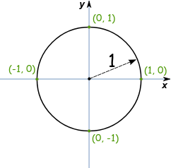
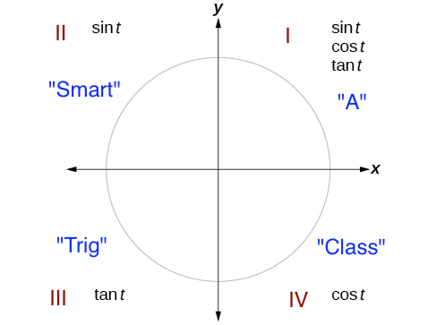

# Sin Cos Tan

$$ 
sin\theta = \frac{oppsite}{hypotenuse} 
$$

$$ 
cos\theta = \frac{adjacent}{hypotenuse}
$$

$$ 
tan\theta = \frac{oppsite}{adjacent}
$$

## SOH , CAH , TOA

&nbsp;  
&nbsp;  
# Unit circle

## Sine sign in different quarters
"A Smart Trig Class" : mark positive sign in each quarters

- [copy write](https://courses.lumenlearning.com/boundless-algebra/chapter/trigonometric-functions-and-the-unit-circle/)

## Number to remember

|     | 0 | 45        | 90 |
|-----|---|-----------|----|
| sin | 0 | sqrt(2)/2 | 1  |
| cos | 1 | sqrt(2)/2 | 0  |
| tan | 0 | 1         | -- |

# Reference
- [latex online editor](https://www.codecogs.com/latex/eqneditor.php)
- [Unit circle](https://www.mathsisfun.com/geometry/unit-circle.html)