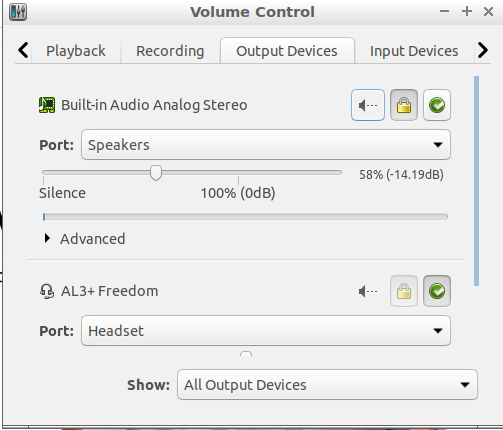

```
sudo apt-get install pulseaudio-module-bluetooth
```

1- open control centre
2- open sound
3- open Output tab
4- select your device (speaker/headset)
3- switch to Hardware tab, your device should be appear and be highlighted
4- at bottom, in 'Settings for selected device", select : High Fidelity Playback (A2DP Sink)




# Reference
- [Bluetooth speaker connecting but not working](https://forums.linuxmint.com/viewtopic.php?t=238083)