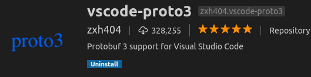

# Protocol buffer
Protocol Buffers is a way to serialize structured data into a binary stream in a fast and efficient manner. It is designed to be used for inter-machine communication and remote procedure calls (RPC)


# Content
- [Install](#install)
- [Hello protocol buffer](#Protobuf-hello-world)
- [Tips](#Tips)

&nbsp;  
&nbsp;  
&nbsp;  
# install 
## Install protoc compiler 
Download the correct binary for example [protoc-3.9.1-linux-x86_64.zip](https://github.com/protocolbuffers/protobuf/releases)

## Install in virtualenv
```bash
(venv)$ pip install protobuf
```
&nbsp;  
&nbsp;  
# Protobuf hello world

project structure

```
├── src
│   ├── demo.py
│   └─ proto
│          ├── __init__.py
│          ├── msg_pb2.py
│          └── msg.proto
├──.env   
└── venv
```


## Defining Protobuf Messages
- Define messages
- Compile messages with `protoc` compiler
- Usage

### Define message
```
syntax = "proto3";

message DemoMsg {
    int32 id = 1;
    string name = 2;
}
```
### Compile
> Don't forget to compile using `protoc`
> `protoc` can be usage from 
>   - command line  
>   - defined `task`
>   - vscode-proto3 ext

#### Command line example 
  
`protoc -I=$SRC_DIR --python_out=$DST_DIR $SRC_DIR/*.proto`

&nbsp;  
&nbsp;  
## usage
```python
from proto import msg_pb2

p = msg_pb2.DemoMsg()
p.id = 1
p.name = "demo 1"
buf = p.SerializeToString()
pp = msg_pb2.DemoMsg()
pp.ParseFromString(buf)
print (pp)
```
&nbsp;  
&nbsp;  
&nbsp;  
# Tips
## Install protobuf extension


## PYTHONPATH
- Setup `PYTHONPATH` using .env file
    -  place `.env` file at the project root folder
  
```
PYTHONPATH=./src:${PYTHONPATH}
```

## protoc task
```json
{
    "version": "2.0.0",
    "tasks": [
        {
            "label": "protoc",
            "type": "shell",
            "command": "protoc",
            "args": [
                "-I",
                "${workspaceFolder}/src/pb_demo/proto",
                "--python_out",
                "${workspaceFolder}/src/pb_demo/proto",
                "${workspaceFolder}/src/pb_demo/proto/*.proto"
            ]
        }
    ]
}
```
&nbsp;  
&nbsp;  
&nbsp;  
# Reference
- [Protobuf Language Guide](https://developers.google.com/protocol-buffers/docs/proto3)
- [Exploring Google Protobuffers with Python](https://dev.to/chen/exploring-google-protobuffers-with-python-1gmd)