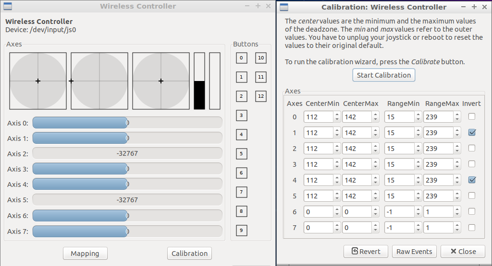
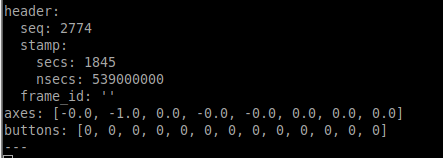

## Install
```
sudo apt install ros-melodic-turtlebot3-simulations
sudo apt install ros-melodic-turtlebot3-description
source /opt/ros/melodic/setup.sh
```

## Trutle types
- burger: LiDAR
- waffle: LiDAR + Realsense
- waffle_pi: LiDAR + Pi camera
  
## Run
```
export TURTLEBOT3_MODEL=burger
roslaunch turtlebot3_gazebo turtlebot3_empty_world.launch
```

## Teleoperation
### Install
```
sudo apt install ros-melodic-turtlebot3-teleop
```
### Run
- Terminale 1
```
roslaunch turtlebot3_gazebo turtlebot3_empty_world.launch
```

- Terminale 2
```
rosrun turtlebot3_teleop turtlebot3_teleop_key
```

> Other worlds
> - turtlebot3_world.launch
> - turtlebot3_house.launch

## Demo
- waffle bot in turtlebot3_world drive by ps joystick

### PS4 Joystick
  - Pair bluetooth
  - Test and calibrate with `jstest-gtk` (`sudo apt install jstest-gtk`)
  

### Install ROS joystick support
```
sudo apt-get install ros-melodic-joy \

```
> roslaunch teleop_twist_joy teleop.launch Dosn't wore with ps4 controller , remove ros-melodic-joystick-drivers , ros-melodic-teleop-twist-joy, use only ros-melodic-joy package
> Write node hanle `joy` message and convert to robot `Twist` message

Test topic for `/joy'
Run `rostopic echo /joy`




- Terminal1 
```
export TURTLEBOT3_MODEL=waffle
roslaunch turtlebot3_gazebo turtlebot3_world.launch
```

- Terminal2
```
rosrun joy joy_node
```

- Terminal3 (my node)
```
rosrun my_pkg Joyteleop_turtlebot3.py
```


```python
#!/usr/bin/env python
import rospy
from geometry_msgs.msg  import Twist
from sensor_msgs.msg import Joy
import sys
import signal

def signal_handler(signal, frame): 
        print('You pressed Ctrl+C!')
        sys.exit(0)


''' class '''
class robot():
    def __init__(self):
        rospy.init_node('robot_controller_ps4', anonymous=True)
        self.velocity_publisher = rospy.Publisher('/cmd_vel', Twist, queue_size=1)
        self.pose_subscriber2 = rospy.Subscriber('/joy',Joy,self.callback)
        self._vel_cmd = Twist()
        self._mapping = {
            "velocity": 1,
            "angal": 3,
            "tri": 2,
            "x": 0,
        }
        self._mapX = self._mapping["velocity"]
        self._mapZ = self._mapping["angal"]
        self._velocity_factor = 0.1

    def velocity_change(self, incr_velocity):
        if incr_velocity:
            self._velocity_factor += 0.1
        else:
            if self._velocity_factor > 0.2:
                self._velocity_factor -= 0.1
        rospy.loginfo("Velocity: {}".format(self._velocity_factor))

    def callback(self, data):
        self._joy_buttons = data.buttons
        self._joy_axes = data.axes
        self._vel_cmd.linear.x = self._velocity_factor * self._joy_axes[self._mapX]
        self._vel_cmd.angular.z = self._velocity_factor * self._joy_axes[self._mapZ]

        if self._joy_buttons[self._mapping["tri"]]:
            self.velocity_change(True)
        if self._joy_buttons[self._mapping["x"]]:
            self.velocity_change(False)


        self.moving()

    def moving(self):
        self.velocity_publisher.publish(self._vel_cmd)

    def __str__(self):
        return "x={}, z={}".format(
            self._joy_axes[self._mapX],
            self._joy_axes[self._mapZ],
            )

if __name__ == '__main__':
    signal.signal(signal.SIGINT, signal_handler)
    turtle = robot()
    while True:
        rospy.Rate(1)
        rospy.sleep(1)
```
## Reference 
- [e-Manual simulation](http://emanual.robotis.com/docs/en/platform/turtlebot3/simulation/#)
