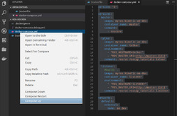
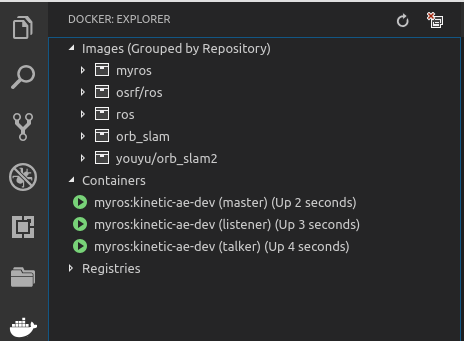

---
layout: post
title: ROS and Docker
categories: ros
tags: [ros, docker]
---

# Multi-Container ROS nodes
- Pull docker form hub
- Add workspace 
- Commit docker
- Create internal network
- Run multi container
  - master node
  - talker node
  - listener node 

## Pull image
> Check `https://hub.docker.com/r/osrf/ros/tags` for request TAG

```
docker pull osrf/ros:kinetic-desktop-xenial
```

# Run image and add workspace
- Run image
- Create catkin ws
- Clone ros_tutorials as demo
- Run catkin make

### Run Image
```bash
docker run -it --name=catkin_ws osrf/ros:kinetic-desktop-xenial
```
### Create ws and clone
> Remove root CMakeLists.txt

```bash
apt update
mkdir -p  /root/catkin_ws/src
cd /root/catkin_ws
catkin_init_workspace

git clone https://github.com/ros/ros_tutorials.git
touch ros_tutorials/turtlesim/CATKIN_IGNORE
cd /root/catkin_ws
catkin_make
#Rename CMakeLists.txt soft link to bk or remove it
```

## Add source to docker entry point
- Add source ws to `ros_entrypoint.sh`
- Use sed append after match `/a`
```bash
sed -i \
    '/source "\/opt\/ros\/$ROS_DISTRO\/setup.bash"/a source "\/root\/catkin_ws\/devel\/setup.bash"' \
    /ros_entrypoint.sh
```
  
## Committing changes
```bash
exit
#commit
docker commit \
--author="AE" \
--message="ros kinetic with ws" \
catkin_ws \
myros:kinetic-ae-dev
```

### inspect new image
```
docker inspect myros:kinetic-ae-dev
```

## Create network
```
docker network create ae_dev
```

# Run services
## Ros core
```bash
docker run -it \
--net ae_dev \
--name master \
myros:kinetic-ae-dev \
roscore
```
##  Talker node
- Set env. variable for find ros core
```bash
docker run -it --rm \
--net ae_dev \
--name talker \
--env ROS_HOSTNAME=talker \
--env ROS_MASTER_URI=http://master:11311 \
myros:kinetic-ae-dev \
rosrun roscpp_tutorials talker
```

## Listener node
> --rm: delete to container on exit

```bash
docker run -it --rm \
--net ae_dev \
--name listener \
--env ROS_HOSTNAME=talker \
--env ROS_MASTER_URI=http://master:11311 \
myros:kinetic-ae-dev \
rosrun roscpp_tutorials listener
```

## Teardown
- docker stop: ask process first to stop nicely by sending `SIGTERM` if not exit send `SIGKILL`
- docker kill: send  `SIGKILL` to  container
    
```bash
docker stop master talker listener
docker rm master talker listener
```

# Using Docker compose
Compose is a tool for defining and running multi-container Docker applications, docker-compose is a yaml file where we declare our services and the docker environment to run: like network and volumes
after declare the yaml file we can run all the services with `docker-compose up` and teardown with `docker-compose down`

In our example we use docker-compose to run our there services
- master
- talker
- listener

## Prerequisite
- Install  `sudo apt install docker-compose`
- Install vscode `docker plugin`
- Open new project and add ^p `Docker:add docker files to workspace`


## compose file
```yml
version: '3'

services:
  master:
    image: myros:kinetic-ae-dev
    container_name: master
    command:
      - roscore

  talker:
    image: myros:kinetic-ae-dev
    container_name: talker
    environment:
      - "ROS_HOSTNAME=talker"
      - "ROS_MASTER_URI=http://master:11311"
    command: rosrun roscpp_tutorials talker

  listener:
    #build: .
    image: myros:kinetic-ae-dev
    container_name: listener
    environment:
      - "ROS_HOSTNAME=listener"
      - "ROS_MASTER_URI=http://master:11311"
    command: rosrun roscpp_tutorials listener

networks: 
  default:
    external:
      name: ae_dev

```






- Use `docker-compose  logs <service name >` to view service console

> Run it from docker-compose file location
```
docker-compose logs talker

talker      | [ INFO] [1553925314.822897899]: hello world 2184
talker      | [ INFO] [1553925314.922985094]: hello world 2185
talker      | [ INFO] [1553925315.022968504]: hello world 2186
talker      | [ INFO] [1553925315.122948490]
```

## Take down
from `vscode` right click on compose file and select `Compose Down`

- Or run from console

```
docker-compose down 


Stopping master   ... done
Stopping listener ... done
Stopping talker   ... done
Removing master   ... done
Removing listener ... done
Removing talker   ... done
Network ae_dev is external, skipping

```


## Run ROS With GUI support

```
sudo xhost +
docker run -it --rm \
--name ros \
-e DISPLAY=$DISPLAY \
-v /tmp/.X11-unix:/tmp/.X11-unix  \
osrf/ros:kinetic-desktop-full
```

## Reference
- [Multi-Container ROS nodes](https://github.com/ruffsl/ros_docker_demos/tree/master/multicontainer)