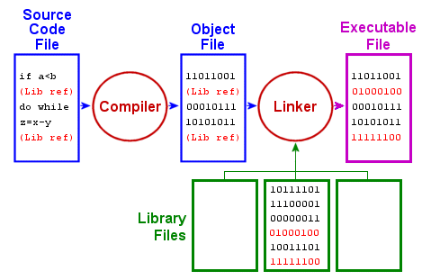
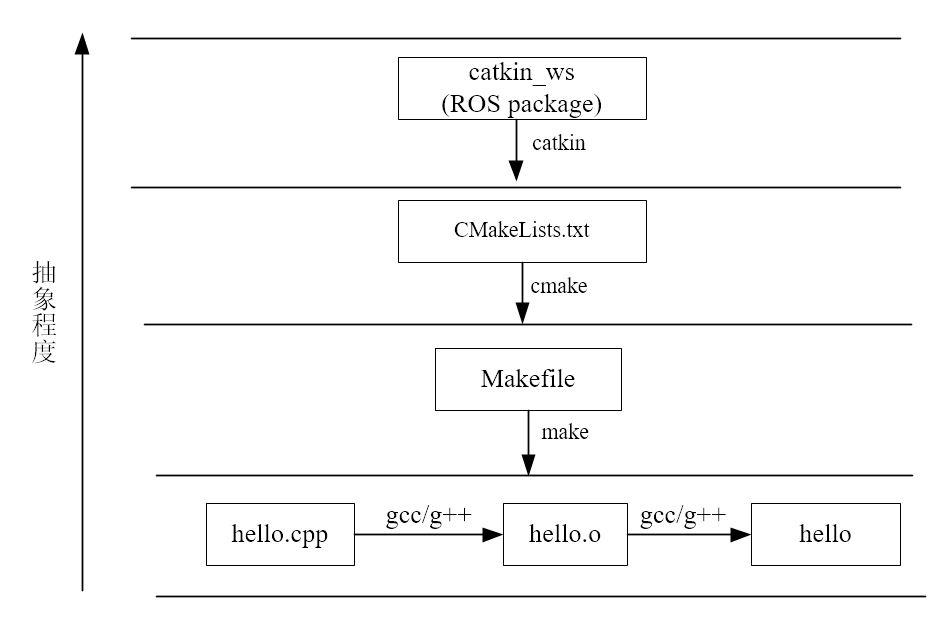

command line g++ 
Makefile file
cmake file
catkin


## Pkg-Config
Return metainformation about installed libraries
```
sudo apt install pkg-config
```
Many libraries provide `.pc` files  which describe their include directories, link directories libraries and require flags

> ROS pc files in `/opt/ros/melodic/lib/pkgconfig`

## CMake
In linux cmake create `Makefile`

## Catkin
The goal Catkin is to make local collections of source-code-only packages behave more like system installations of binary packages. This is done not by creating an entirely new buildsystem, but by defining some catkin-specific CMake macros and functions which configure CMake in a special way

## ROS Package
ROS Package are folder with xml file  as manifest file
The `package.xml` file allow tools like rospack to determine information about the package

extension






# catkin_tools
- [Read the docs](https://catkin-tools.readthedocs.io/en/latest/installing.html)


# Reference
- [A Gentle Introduction to Catkin](http://jbohren.com/tutorials/2014-02-12-gentle-catkin-intro/)