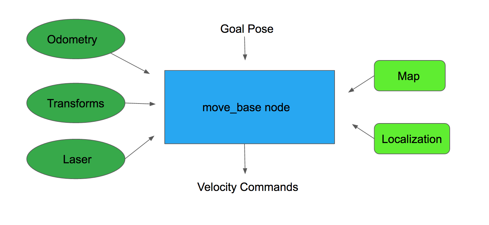

Mapping
Localization
Path planing

# Mapping
In order to perform autonomous navigation the robot must have a map of the environment

# Navigation stack
 The main objective of the Navigation Stack is to move a robot from a position A to a position B, assuring it won't crash against obstacles, or get lost in the process.
 
 The Navigation stack take as an input the
 current location
 desired location
 Odometry
    encoders
    IMU
    GPS
Input sensor
    Laser
The Navigation stack output velocity command `cmd_vel`


# The move_base node




```
docker run -it \
    --env="DISPLAY" \
    --volume="/etc/group:/etc/group:ro" \
    --volume="/etc/passwd:/etc/passwd:ro" \
    --volume="/etc/shadow:/etc/shadow:ro" \
    --volume="/etc/sudoers.d:/etc/sudoers.d:ro" \
    --volume="/tmp/.X11-unix:/tmp/.X11-unix:rw" \
    osrf/ros:kinetic-desktop-full-xenial
    /bin/bash
```