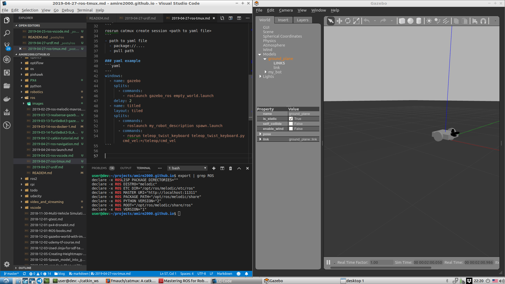

Using tmux to launch multiple ros terminals, Using manual tmux terminal, write bash script and the better method using catmux ROS node

- Create manual windows and panes
- Create BASH script
- Using catmux
  
## Manual launching
```bash
tmux new -s ros_launch
# replace C-b with C-a
C-a : new-window
C-a : split-window -v
#move to previous window
C-a : previous-window
C-a : rename-window gazebo
roslaunch gazebo_ros empty_world.launch
#move to next window
C-a : next-window
C-a : select-pane -t 0
# spawn model
roslaunch my_robot_description spawn.launchroslaunch my_robot_description spawn.launch
C-a : select-pane -t 1
# run teleop
rosrun teleop_twist_keyboard teleop_twist_keyboard.py cmd_vel:=/teleop/cmd_vel

# kill session
C-a : kill-session
```


## tmux script 
launch_me.sh
```bash
#!/bin/bash

tmux new-session -s ros -d 
tmux split-window -v -p 20
tmux select-pane -t 0
tmux split-window -v 

tmux select-pane -t 0
tmux send-keys "roslaunch gazebo_ros empty_world.launch" C-m
tmux select-pane -t 1
tmux send-keys "roslaunch my_robot_description spawn.launch" C-m
tmux select-pane -t 2
tmux send-keys "rosrun teleop_twist_keyboard teleop_twist_keyboard.py cmd_vel:=/teleop/cmd_vel" C-m
```

usage
```bash
./launch_me.sh
tmux attach

#exit
tmux kill-session
```


## Catmux
Catmux is a little helper to run a tmux session with multiple windows and panes with just one command
- [source](https://github.com/fmauch/catmux)

### Installation
catmux deploy as a ros package, clone to catkin and build

usage
```
rosrun catmux create_session <path to yaml file>
```
- path to yaml file
  - package://....
  - pull path

### yaml example
```yaml
---
windows:
  - name: gazebo
    splits:
      - commands:
        - roslaunch gazebo_ros empty_world.launch
    delay: 2
  - name: titled
    layout: tiled
    splits:
      - commands:
        - roslaunch my_robot_description spawn.launch
      - commands:
        - rosrun teleop_twist_keyboard teleop_twist_keyboard.py cmd_vel:=/teleop/cmd_vel
```

