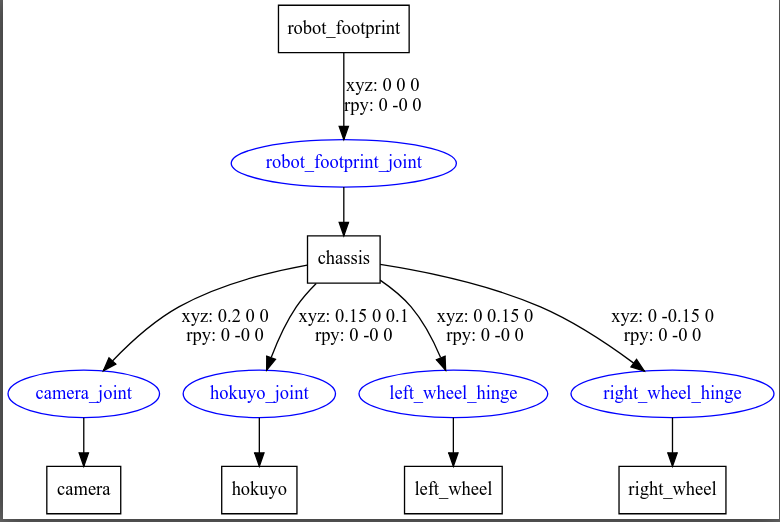

## URDF tools
- check_urdf
Attempts to parse a file as a URDF description, and either prints a description of the resulting kinematic chain, or an error message. 

- urdf_to_graphiz
Generated pdf or grap from urdf

### Install
```
sudo apt install liburdfdom-tools
```

### usage
- check_urdf
```
check_urdf /tmp/my_bot.urdf

robot name is: my_bot
---------- Successfully Parsed XML ---------------
root Link: robot_footprint has 1 child(ren)
    child(1):  chassis
        child(1):  camera
        child(2):  hokuyo
        child(3):  left_wheel
        child(4):  right_wheel
```

- urdf_to_graphiz
```
urdf_to_graphiz /tmp/my_bot.urdf

```


> Tip: Install Graphviz Preview to view / preview `gv` files inside vscode

### check xacro file
> Tip: xacro app need full path to xacro file

```
check_urdf <(xacro ~/catkin_ws/src/my_robot_description/urdf/my_bot.xacro)
```

### VSCode integration
- Objective
  - Run urdf and xacro validation 
  - Using `check_urdf`

- Used `Run in Terminal` extension [link](https://marketplace.visualstudio.com/items?itemName=kortina.run-in-terminal) to execute check_urdf in terminal window
- Declare keybindings to run the validation

#### keybindings.json
```json
{
    "key": "ctrl+m",
    "command": "runInTerminal.run",
    "args": {
        "cmd": "check_urdf ${file}",
        "match": ".*"
    },
    "when": "resourceExtname==.urdf"
}
```


## Reference
- [URDF ROS wiki](http://wiki.ros.org/urdf)
- [VSCode keybindings](https://code.visualstudio.com/docs/getstarted/keybindings)