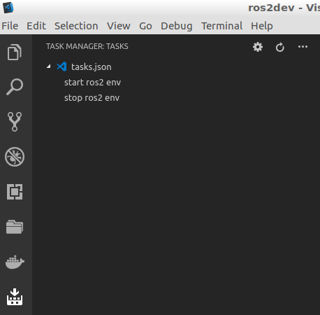
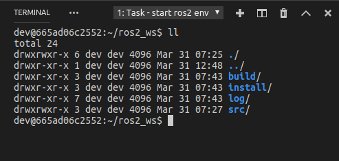
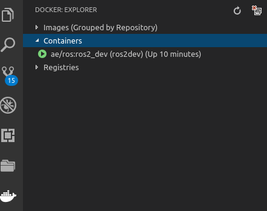

- Topics
  -  ROS2 Releases
  -  ROS2 Docker
  -  Build Dev dockerfile
  -  Config VSCode 
  -  Write and test first python node
  
## ROS2 Releases
- Crystal Clemmys (12/18)
- Bouncy Bolson (07/18)
- ArdentApalone (12/17)

## ROS2 Dockerize
- Get nightly build from docker hub
```
docker pull osrf/ros2:nightly
```

## Custom Dockerfile
- Use osrf/ros2:nightly as base
- Install  `apt` sudo packags
- Add dev user, set password
- Set working directory

```docker
FROM osrf/ros2:nightly

RUN apt-get update && apt-get install -y --no-install-recommends apt-utils
RUN apt-get install sudo -y  && \
    apt-get clean autoclean && \
    apt-get autoremove -y && \
rm -rf /var/lib/apt/lists/*

RUN useradd -ms /bin/bash dev
RUN echo "dev  ALL=(ALL:ALL) ALL" >> /etc/sudoers
RUN echo "dev:dev" | chpasswd 
# for gdbserver
EXPOSE 2000

USER dev
VOLUME "/home/dev/ros2_ws"
WORKDIR "/home/dev/ros2_ws"
```

## Config VSCode
- Add docker-compose.yml
- Add Tasks `tasks.json`


### docker-compose.yml
```yml
version: '2'

services:
  ros2dev:
    image: ae/ros:ros2_dev
    build: .
    privileged: true
    container_name: ros2dev
    volumes: 
      - ./ros2_ws:/home/dev/ros2_ws
```

### Tasks
- Add start and stop dev env.

```json
{
    "version": "2.0.0",
    "tasks": [
        {
            "label": "start ros2 env",
            "type": "shell",
            "command": "docker-compose -f docker-compose.yml run --service-ports --name ros2dev ros2dev",
            "problemMatcher": []
        },
        {
            "label": "stop ros2 env",
            "type": "shell",
            "command": "docker-compose -f docker-compose.yml down",
            "problemMatcher": []
        }
    ]
}
```

> Use VSCode docker ext.
> USe Task Manager ext.

# Start docker dev env.
- Start task
  


- Docker shell (folder shown after create a workspace)
  


- View docker container



# Write first python node
- Launch start task
- From docker shell
  - Create a workspace (first time)
  - Create a package
- From vscode
  - Add python node file
  - Modify package.xml
  - Remove CMakeLists.txt
  - Add setup.py file
  - Add setup.cfg file

## Create WS
```
mkdir -p ros2_ws/src && cd ros2_ws
colcon build
```
- build create
  - build, install and log folders
  
## Source WS
```bash
# from ws root
source install/local_setup.bash && source install/setup.bash
```

## Create a package
```
cd ros2_ws/src
ros2 pkg create ros2_py
```

## Add node
- Create python file `hello_pub.py`

## Modify/Add 
- package.xml
- setup.py

### package.xml
- Todo
  
### Setup.py
- Set  packages  or py_models
- Modify `entry_points`
```
entry_points={
        'console_scripts': [
            'hello_pub = hello_pub:main',
        ],
    },
```
## build
- From Workspace root
```
$ colcon build
$ source install/setup.bash && source install/local_setup.bash
```

## Run
```
ros2 run ros2_py hello_pub
```


#  Referennce
- [My Code](https://github.com/amire2000/ros2dev)
- [ros2 example](https://github.com/ros2/examples/tree/master/rclpy/topics)
- [How to create & test a Publisher in ROS2 (Python)](http://www.theconstructsim.com/create-python-publisher-ros2/)