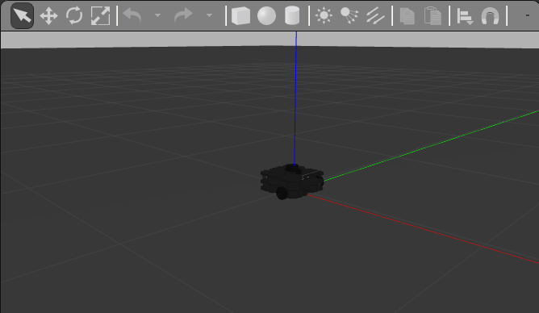

Run ROS2 Bridge to ROS1
- ROS1 run gazebo and publish turtlebot `/odom` topic
- Bridge translate between ROS1 to ROS2 
- ROS2 Custom node register to /odom topic

# Using ROS1 bridge

- Terminal1 (gazebo)
```
source /opt/ros/melodic/setup.bash
export TURTLEBOT3_MODEL="waffle"
roslaunch turtlebot3_gazebo turtlebot3_empty_world.launch
```


- Terminal2 (bridge)
  - Run ROS2 from binary install location (not apt install method)
```
. /opt/ros/melodic/setup.bash
. ~/ros2_install/ros2-linux/setup.bash
ros2 run ros1_bridge dynamic_bridge
```

- Terminal3 (/odom subscriber)
  - Run odom subscribe node
  > ROS2 install from binary at user home directory `ros2_install`
```
cd ~
. ros2_install/ros2-linux/setup.bash
cd ~/ros2_ws
. install/local_setup.bash
ros2 run topic_subscriber_pkg simple_odom_node
```
- Subscriber return pos x location
```
[INFO] [odom_subscriber]: I heard: '0.094368'
[INFO] [odom_subscriber]: I heard: '0.094366
```

- After run ROS2 Node bridge note the mapping message
```
[INFO] [ros1_bridge]: Passing message from ROS 1 nav_msgs/Odometry to ROS 2 nav_msgs/Odometry (showing msg only once per type)

```

- Terminal4 (teleop)
```
. /opt/ros/melodic/setup.bash
export TURTLEBOT3_MODEL="waffle"
rosrun turtlebot3_teleop turtlebot3_teleop_key 
```

> Note: Run ros bridge after launch Gazebo, its Start `roscore`

> Note: My install throw bridge warring but working

```
ros2 run ros1_bridge dynamic_bridge
Created 2 to 1 bridge for service /camera/set_camera_info
Created 2 to 1 bridge for service /gazebo/pause_physics
Created 2 to 1 bridge for service /gazebo/reset_simulation
Created 2 to 1 bridge for service /gazebo/reset_world
Created 2 to 1 bridge for service /gazebo/unpause_physics
Created 2 to 1 bridge for service /imu_service
failed to create 2to1 bridge for topic '/rosout' with ROS 2 type 'rcl_interfaces/Log' and ROS 1 type 'rosgraph_msgs/Log': No template specialization for the pair
check the list of supported pairs with the `--print-pairs` option
failed to create 2to1 bridge for topic '/rosout' with ROS 2 type 'rcl_interfaces/Log' and ROS 1 type 'rosgraph_msgs/Log': No template specialization for the pair
...
[INFO] [ros1_bridge]: Passing message from ROS 1 nav_msgs/Odometry to ROS 2 nav_msgs/Odometry (showing msg only once per type)
...
```