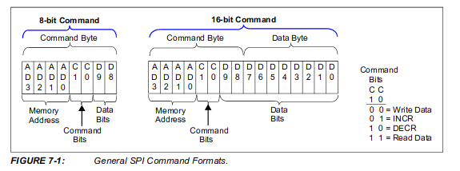

SPI (Serial Peripheral Interface) is a full duplex synchronous serial communication interface used for short distance communications. SPI devices communicates each other using a master slave architecture with a single master. Multiple slaves are supported through individual slave select lines.
RPi support Tow slaves (rpi3 pin 24,26)

- SCK  (SCLK): Clock from master    (rpi3 pin23)
- MOSI (SDO): Master Out Slave In (rpi3 pin19)
- MISO (SDI): Master In Slave Out (rpi3 pin21)
- SS   (CS): Slave select          (rpi3 pin 24,26)

SPI is called as a 4-wire bus as it requires four wires for its communication. In the case of single slave communications we need only 3 wires, as slave select (SS) is not required.
Connecting multiple salve check [sparkfun](https://learn.sparkfun.com/tutorials/serial-peripheral-interface-spi)


- Image from sparkfun.com

&nbsp;  
&nbsp;  
&nbsp;  
# MCP4131





&nbsp;  
&nbsp;  
&nbsp;  
# Raspberry Pi 3+
> os: ubuntu 18.04

> WiringPi is not supported on any other operating systems than Raspbian (gpio readall)

## pin layoout


## check for spi
```
$ ls /dev/spi*
/dev/spidev0.0  /dev/spidev0.1
```
&nbsp;  
&nbsp;  
&nbsp;  
# wiring
| rpi         | mcp          |
|-------------|--------------|
| CEO(pin24)  | 01 (CS)      |
| SCLK(pin23) | 02 (SCK)     |
| GND (pin06) | 04 (VSS)     |
| 3.3 (pin01) | 08 (VDD)     |
&nbsp;  
&nbsp;  
&nbsp;  
# spidev
- Download spidev test from [spidev test](https://github.com/rm-hull/spidev-test)
- compile and run

```bash
# compile
gcc spidev_test.c -o spidev_test

# Run
sudo ./spidev_test -v
sudo: unable to resolve host ubuntu
spi mode: 0x0
bits per word: 8
max speed: 500000 Hz (500 KHz)
TX | FF FF FF FF FF FF 40 00 00 00 00 95 FF FF FF FF FF FF FF FF FF FF FF FF FF FF FF FF FF FF F0 0D  | ......@....�..................�.
RX | FF FF FF FF FF FF 40 00 00 00 00 95 FF FF FF FF FF FF FF FF FF FF FF FF FF FF FF FF FF FF F0 0D  | ......@....�..................�.
# With the MOSI (master out, slave in) pin connected to the MISO (master in, slave out), the received data should be exactly the same as the transmitted data, as in the above example.
```
&nbsp;  
&nbsp;  
&nbsp;  
# Python
## install
```bash
# need dependency
sudo apt-get install python3-dev
# pip
pip3 install spidev
```

## test script
```python
#!/usr/bin/python
import spidev
import time

spi = spidev.SpiDev()
spi.open(0, 0)
spi.max_speed_hz = 976000

def write_pot(input):
    msb = input >> 8
    lsb = input & 0xFF
    spi.xfer([msb, lsb])

while True:
    for i in range(0x00, 0x1FF, 1):
        write_pot(i)
        time.sleep(2)
    for i in range(0x1FF, 0x00, -1):
        write_pot(i)
        time.sleep(2)
```
&nbsp;  
&nbsp;  
&nbsp;  
# Resource
- [RPI Installing SPI](https://github.com/BitKnitting/should_I_water/wiki/Installing-SPI)
- [SPI – Serial Peripheral Interface](https://electrosome.com/spi/)
- [sparkfun](https://learn.sparkfun.com/tutorials/serial-peripheral-interface-spi)
- [spidev test](https://github.com/rm-hull/spidev-test)
- [Controlling the MCP4151 Digital Potentiometer with the Raspberry Pi](https://www.takaitra.com/mcp4151-digital-potentiometer-raspberry-pi/)
- [MCP Spec](http://ww1.microchip.com/downloads/en/devicedoc/22060a.pdf)