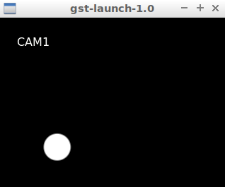

## Networking 
- h264 codec
- rtp
```
gst-launch-1.0 videotestsrc pattern="ball" ! \
 video/x-raw,width=640,height=480 ! \
 videoconvert ! \
 x264enc ! \
 rtph264pay ! \
 udpsink host=127.0.0.1 port=5600
```
```
gst-launch-1.0 udpsrc port=5600 ! \
 application/x-rtp,encoding-name=H264 ! \
 rtph264depay ! \
 h264parse ! \
 avdec_h264 ! \
 autovideosink
```

## Mixer
```
gst-launch-1.0 videotestsrc pattern="ball" ! \
 video/x-raw,width=320,height=240 ! \
 videobox left=-320 border-alpha=0 ! \
 videomixer name="mix" ! \
 autovideosink \
 videotestsrc ! \
 video/x-raw,width=320,height=240 ! \
 mix.
```

### Mixer with network
```
gst-launch-1.0 videotestsrc pattern="ball" ! \
 video/x-raw,width=320,height=240 ! \
 videobox left=-320 border-alpha=0 ! \
 videomixer name="mix" ! \
 x264enc ! \
 rtph264pay ! \
 udpsink host=127.0.0.1 port=5600 \
 videotestsrc ! \
 video/x-raw,width=320,height=240 ! \
 mix.
```

-  not work to check
```
gst-launch-1.0 videomixer name=mix \
    sink_0::xpos=0   sink_0::ypos=0  sink_0::alpha=0 \
    sink_1::xpos=0   sink_1::ypos=0 \
    sink_2::xpos=200 sink_2::ypos=0 \
    autovideosink \
 videotestsrc pattern="ball" ! \
 videoconvert ! \
   mix.sink1 \
 videotestsrc ! \
 videoconvert ! \
  mix.sink2
```

## Add text to image
```
gst-launch-1.0 -v videotestsrc pattern="ball" !  video/x-raw,width=320,height=240 !  textoverlay text="CAM1"  font-desc="Sens 24" valignment=top halignment=left ! \
autovideosink
``` 


## Video scale
```
gst-launch-1.0 -v videotestsrc ! \
videoscale ! \
video/x-raw,width=100,height=100 ! \
autovideosink
```

## Video rate (fps)
```
gst-launch-1.0 -v videotestsrc pattern="ball" ! \
videorate ! \
video/x-raw,framerate=1/1 ! \
autovideosink
```