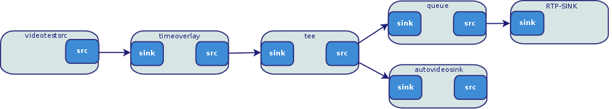
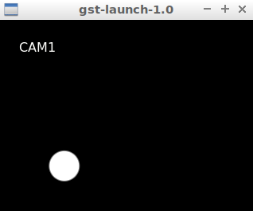

# First pipe
```
gst-launch-1.0 videotestsrc ! video/x-raw,width=640,height=480 ! autovideosink
```
- Read from camera
```
gst-launch-1.0 v4l2src device="/dev/video1" ! video/x-raw,width=640,height=480 ! videoconvert ! autovideosink
```

## Encoding
- mjpeg: jpegenc
- VP8: vp8enc
- Mpeg2: avenc_mpeg4

## Payload
packing the data into network protocol
- RTP: Real Time Prorocol
- GDP: Gstreamer Data Protocol

### Examples
- rtpkpegpay
- rtpv8pay
- rtpmp4vpay
- rtpvrawpay

Send stream
- udp
- tcp
- multiudpsink

source -> encode ->  pack -> send

recv -> unpack -> decode -> sink

### MJPEG
- Tx
```
gst-launch-1.0 -v v4l2src device="/dev/video1" \
! video/x-raw,width=640,height=480 \
! videoconvert \
! jpegenc \
! rtpjpegpay \
! udpsink host=127.0.0.1 port=5000
```
-Rx
```
gst-launch-1.0 udpsrc port=5000 \
! application/x-rtp,encoding-name=JPEG,ayload=26 \
! rtpjpegdepay \
! jpegdec \
! autovideosink
```

### h264
- Tx
```
gst-launch-1.0 -v v4l2src device="/dev/video1" \
! video/x-raw,framerate=20/1 \
! videoconvert \
! x264enc tune=zerolatency bitrate=500 speed-preset=superfast \
! rtph264pay \
! udpsink host=127.0.0.1 port=5000
```

- Rx
```
gst-launch-1.0 udpsrc port=5000 caps = "application/x-rtp, media=(string)video, clock-rate=(int)90000, encoding-name=(string)H264, payload=(int)96" \
! rtph264depay \
! decodebin \
! videoconvert \
! autovideosink
```

> Caps format as element  property


### Mpeg 2 streaming
- Codec from `libav`
```
gst-launch-1.0 -v v4l2src device="/dev/video1" \
! video/x-raw,width=640,height=480 \
! videoconvert \
! avenc_mpeg4 \
! rtpmp4vpay config-interval=3 \
! udpsink host=127.0.0.1 port=5200
```
- config-interval: Send Config Insertion Interval in seconds (0=disabled), without this properties the recv is out of sink
```
gst-launch-1.0 -v udpsrc port=5200 \
! application/x-rtp,clock-rate=90000,payload=96 \
! rtpmp4vdepay \
! avdec_mpeg4 \
! autovideosink
```
> Don't forget config-interval


### tee and queue
- Split camera and display image as color and gray scale
- Queue, Create thread that handle queue data
```
gst-launch-1.0 -v v4l2src device="/dev/video1" \
! video/x-raw,width=640,height=480 \
! tee name=t \
t. ! queue ! videoconvert \
! autovideosink sync=false \
t. !  queue ! videoconvert ! \
video/x-raw,format=GRAY8 \
! videoconvert \
! autovideosink sync=false
```

#### Demo (time overlay)
- Tx
```
gst-launch-1.0 v4l2src  device="/dev/video1" \
 ! video/x-raw,width=640,height=480 \
 ! timeoverlay \
 ! tee name="local" \
 ! queue \
 ! videoconvert \
 ! autovideosink sync=false\
 local. \
 ! queue \
 ! jpegenc \
 ! rtpjpegpay \
 ! udpsink host=127.0.0.1 port= 5000
```
- Rx
```
gst-launch-1.0 udpsrc port=5000 \
! application/x-rtp,encoding-name=JPEG,payload=26 \
! rtpjpegdepay \
! jpegdec \
! autovideosink sync=false
```


## Mixer
```
gst-launch-1.0 videotestsrc pattern="ball" ! \
 video/x-raw,width=320,height=240 ! \
 videobox left=-320 border-alpha=0 ! \
 videomixer name="mix" ! \
 autovideosink \
 videotestsrc ! \
 video/x-raw,width=320,height=240 ! \
 mix.
```

### Mixer with network
```
gst-launch-1.0 videotestsrc pattern="ball" ! \
 video/x-raw,width=320,height=240 ! \
 videobox left=-320 border-alpha=0 ! \
 videomixer name="mix" ! \
 x264enc ! \
 rtph264pay ! \
 udpsink host=127.0.0.1 port=5600 \
 videotestsrc ! \
 video/x-raw,width=320,height=240 ! \
 mix.
```

-  not work to check
```
gst-launch-1.0 videomixer name=mix \
    sink_0::xpos=0   sink_0::ypos=0  sink_0::alpha=0 \
    sink_1::xpos=0   sink_1::ypos=0 \
    sink_2::xpos=200 sink_2::ypos=0 \
    autovideosink \
 videotestsrc pattern="ball" ! \
 videoconvert ! \
   mix.sink1 \
 videotestsrc ! \
 videoconvert ! \
  mix.sink2
```

## Add text to image
```
gst-launch-1.0 -v videotestsrc pattern="ball" !  video/x-raw,width=320,height=240 !  textoverlay text="CAM1"  font-desc="Sens 24" valignment=top halignment=left ! \
autovideosink
``` 


## Video scale
```
gst-launch-1.0 -v videotestsrc ! \
videoscale ! \
video/x-raw,width=100,height=100 ! \
autovideosink
```

## Video rate (fps)
```
gst-launch-1.0 -v videotestsrc pattern="ball" ! \
videorate ! \
video/x-raw,framerate=1/1 ! \
autovideosink
```

## Convert mjpeg to h264
- Tx
  - convert mjpeg to h264
  - Use x264 rx example to watch the stream
```
gst-launch-1.0 v4l2src device="/dev/video1" \
! image/jpeg,width=800,height=600,framerate=10/1 \
! jpegdec \
! x264enc tune=zerolatency \
! rtph264pay \
! udpsink host=127.0.0.1 port=5000
```


# Reference
- [NVIDIA Accelerated gstreamer user guide](https://usermanual.wiki/Document/AcceleratedGStreamerUserGuideRelease2421.1763245798/view)
- [RTP UDP](https://m.blog.naver.com/PostView.nhn?blogId=chandong83&logNo=221263551742&categoryNo=54&proxyReferer=https%3A%2F%2Fwww.google.com%2F)
- [Videostreaming with Gstreamer](http://z25.org/static/_rd_/videostreaming_intro_plab/index.html)