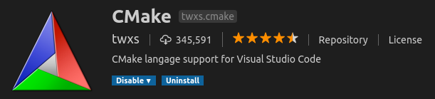
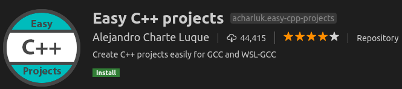

# Content
- Install C/Cpp extension
- [Build and Run](#build-and-run)
  - Using `g++`
- [Config Debugger](#debug)
- [Using cmake](#using-cmake)
- [Other cpp utils extensions](#other-extensions)
  
&nbsp;  
&nbsp; 
# Install C/C++ 
- Install C/C++ extanstion
  


## Extension setup and config
### Add intelliSense
- [c/cpp IntelliSense](https://github.com/microsoft/vscode-cpptools/blob/master/Documentation/Getting%20started%20with%20IntelliSense%20configuration.md)

TBD
&nbsp;  
&nbsp;  
&nbsp;  

# Build and Run
- `task.json include two tasks`
  - **debug**: compile current file for debugging 
    - use -g argument
  - **compile and run**: 
    - using g++ command line
    - set as default task, 
    - run by using `ctrl-shift-b`
  - **compile multiple**:
    - see Tip
    - `"${fileDirname}/**.cpp"`


```json
{
    "version": "2.0.0",
    "tasks": [
        {
            "label": "debug",
            "type": "shell",
            "command": "",
            "args": [
                "g++",
                "-g",
                "${relativeFile}",
                "-o",
                "bin/${fileBasenameNoExtension}"
            ]
        },
        {
            "label": "Compile and run",
            "type": "shell",
            "command": "",
            "args": [
                "g++",
                "-g",
                "${relativeFile}",
                "-o",
                "bin/${fileBasenameNoExtension}",
                "&&",
                "bin/${fileBasenameNoExtension}"
            ],
            "group": {
                "kind": "build",
                "isDefault": true
            }
        }
    ]
}
```

### Tip
- compile multiple files
    - Replace `"${relativeFile}"` with `"${fileDirname}/**.cpp"`
&nbsp;  
&nbsp;  
&nbsp;  
# Debug
## Setup launch.json file
```json
{
    "version": "0.2.0",
    "configurations": [

        {
            "name": "(gdb) Launch",
            "type": "cppdbg",
            "request": "launch",
            "program": "${workspaceFolder}/bin/${fileBasenameNoExtension}",
            "args": [],
            "stopAtEntry": false,
            "cwd": "${workspaceFolder}",
            "environment": [],
            "externalConsole": false,
            "MIMode": "gdb",
            "setupCommands": [
                {
                    "description": "Enable pretty-printing for gdb",
                    "text": "-enable-pretty-printing",
                    "ignoreFailures": true
                }
            ],
            "preLaunchTask": "debug"
        }
    ]
}
```
- `preLaunchTask`: Using debug task to build before enter debugging
- `MIMode`: using `gdb` as debugger
- `program`: set path to binary
- `externalConsole`: true/ false

&nbsp;  
&nbsp;  
&nbsp;  
# Using cmake
- Add CMakeLists.txt to project
    

```bash
cmake_minimum_required(VERSION 3.10)
project(tutorial)
set (BIN_NAME app)
set (SOURCE src/hello.cpp)
#Set CXX flags to c++11
set(CMAKE_CXX_FLAGS "${CMAKE_CXX_FLAGS} -std=c++11")
add_executable(${BIN_NAME} ${SOURCE})
#make install
install(TARGETS ${BIN_NAME} DESTINATION ${PROJECT_BINARY_DIR}/../bin)
```

## Add `debug` flag
- CMakeLists.txt
```
set(CMAKE_BUILD_TYPE Debug)
```

- command line argument
```bash
#cmake -D<arg name>=<arg value> <path>
cmake -DCMAKE_BUILD_TYPE=Debug ..
```

## VSCode tasks
- cmake: run `cmake` command to build Makefile
- make: run `make` command

```json
{
    "version": "2.0.0",
    "tasks": [
        {
            "label": "cmake",
            "type": "shell",
            "command": "cmake",
            "args": [
                "-DCMAKE_BUILD_TYPE=Debug",
                ".."
            ],
            "options": {
                "cwd": "${workspaceRoot}/build"
            }
        },
        {
            "label": "Build & run C++ project",
            "type": "shell",
            "group": {
                "kind": "build",
                "isDefault": true
            },
            "command": "make",
            "options": {
                "cwd": "${workspaceRoot}/build"
            },
            "args": [
                "-j8"
            ],
            "dependsOn": [
                "cmake"
            ]
        }
    ]
}
```

- cmake task
  - pass `debug` build type command to cmake thought command line
  - set working directory to `build` sub folder
- make task
  - make depends on `cmake` task
  - set working directory to `build` sub folder
  - pass arguments `j8` to make commands
  

&nbsp;  
&nbsp;  
&nbsp;  
# Other extensions
- Google Test
  


- CMake



- C++ Projects


<!--  -->
