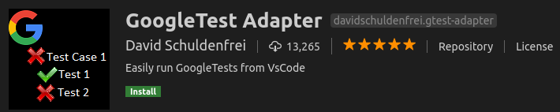

# Content
- Install C/Cpp extension
- Build and Run, tasks.json
- Debug: launch.json
- Other extensions
  
&nbsp;  
&nbsp; 
# Install C/C++ 
- Install C/C++ extanstion
  


## Extension setup and config
### Add intelliSense
- [c/cpp IntelliSense](https://github.com/microsoft/vscode-cpptools/blob/master/Documentation/Getting%20started%20with%20IntelliSense%20configuration.md)

&nbsp;  
&nbsp;  
&nbsp;  

# Build and Run, tasks.json
- Hold two tasks
  - debug: compile current file for debugging (with -g)
  - compile and run: set as default task, run by using `ctrl-shift-b`

&nbsp;  
&nbsp;  
&nbsp;  
# Debug
## Setup launch.json file
```json
{
    "version": "0.2.0",
    "configurations": [

        {
            "name": "(gdb) Launch",
            "type": "cppdbg",
            "request": "launch",
            "program": "${workspaceFolder}/bin/${fileBasenameNoExtension}",
            "args": [],
            "stopAtEntry": false,
            "cwd": "${workspaceFolder}",
            "environment": [],
            "externalConsole": false,
            "MIMode": "gdb",
            "setupCommands": [
                {
                    "description": "Enable pretty-printing for gdb",
                    "text": "-enable-pretty-printing",
                    "ignoreFailures": true
                }
            ],
            "preLaunchTask": "debug"
        }
    ]
}
```
- `MIMode`: using `gdb` as debugger
- `program`: set path to binary
- `externalConsole`: true/ false

# Other extensions
- Google Test


- 