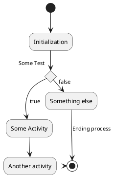

# Content
- Install
- Basic usage
  - markdown
  - Examples
- Github / Git-pages integration
- Reference

# Install


PlantUML has two render method
- Local: For local render `java` and `Graphviz` need to be installed
```
sudo apt install default-jre graphviz
```
- Server: Using server to render and return 

# Basic usage
## Markdown
- Activity diagram


## Examples
Diagrams from [real-world-plantuml](https://real-world-plantuml.com/)

- [sequence](https://real-world-plantuml.com/?type=sequence)
- [usecase](https://real-world-plantuml.com/?type=usecase)
- [class](https://real-world-plantuml.com/?type=class)
- [activity](https://real-world-plantuml.com/?type=activity)
- [component](https://real-world-plantuml.com/?type=component)

# Github / Git-pages 
- image from `blog.anoff.io`
  


Planuml server proxy
- src: url to diagram file 
```

- [Markdown native diagrams with PlantUML](https://blog.anoff.io/2018-07-31-diagrams-with-plantuml/)