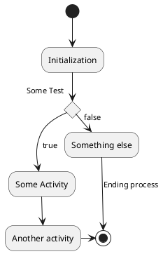

# Content
- Install
- Basic usage
  - markdown
  - Examples
- Github / Git-pages integration
- Reference

# PlantUML

PlantUML has two render method
- Local: For local render `java` and `Graphviz` need to be installed
  
```
sudo apt install default-jre graphviz
```
- Server: Using server to render and return 

&nbsp;  
&nbsp;  
&nbsp;  
# VSCode
[VSCode market](https://marketplace.visualstudio.com/items?itemName=jebbs.plantuml)


## settings.json
```bash
# Server mode
"plantuml.render": "PlantUMLServer",
"plantuml.server": "https://www.plantuml.com/plantuml",

# local
"plantuml.render": "Local",

```
&nbsp;  
&nbsp;  
&nbsp;  
# Basic usage
## Markdown
- Activity diagram for example

```



TBD: Render Not working for gitpages


- [sequence](https://real-world-plantuml.com/?type=sequence)
- [usecase](https://real-world-plantuml.com/?type=usecase)
- [class](https://real-world-plantuml.com/?type=class)
- http://plantuml.com/activity-diagram-beta
- [activity](https://real-world-plantuml.com/?type=activity)
- [component](https://real-world-plantuml.com/?type=component)

# Github / Git-pages 
- image from `blog.anoff.io`
  


# Reference
- [Real world PlantUML](https://real-world-plantuml.com/)
- [Markdown native diagrams with PlantUML](https://blog.anoff.io/2018-07-31-diagrams-with-plantuml/)