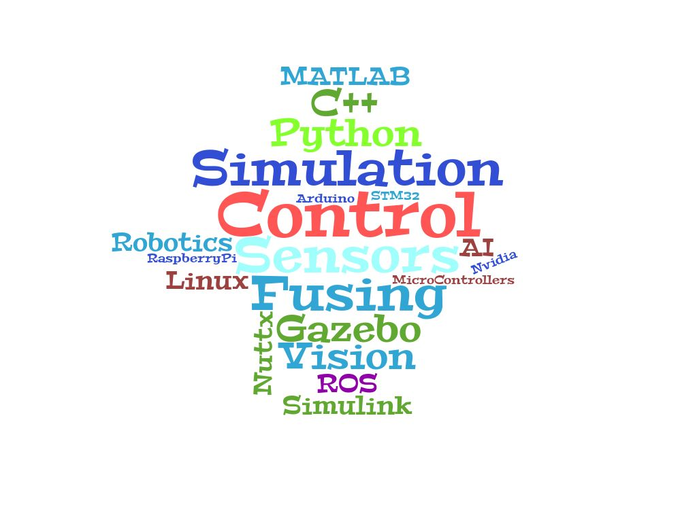

<section id="banner" style="height: 100px; width:1024px">
    <table >
        <tr>
            <td width="20%">
                </td>
            <td  style="color: #fff;text-align: left;vertical-align: middle">
                <h2>About: <em>me</em></h2>
            </td>
            
        </tr>
    </table>
</section>

- Control And Sensor Fusing
  - Vision: Camera, Stereo, 
  - AI
  - Sensors: IMU, GPS, LIDAR and others
- Simulation 
  - Gazebo
  - MATLAB and Simulink
- Software, Hardware and Programing
  - Robotics 
    - ROS
  - Programing
    - Python
    - C++
  - OS and 
    - Linux
    - Nuttx
  - Embedded and MicroControllers
    - Nvidia jetson
    - Raspberry Pi
    - STM32
    - Arduino

<!-- https://www.wordclouds.com/ -->